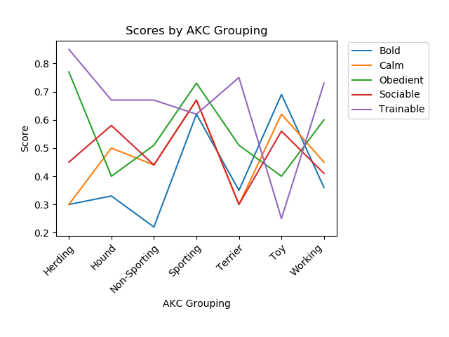

# Study Design

In this study, I'm negotiating the line between making this data publicly accessible (and fun) and ensuring I'm applying analytic rigor. While this study won't be published in an academic journal, I'm transparently including my code and datasets so that those interested can tweak them and discover their own trends.

## Variables evaluated

I performed a Chi-square test to determine if a person's borough is statistically relevant to what type of dog that person owns. I performed the test at the 0.05 significance level. The null hypothesis was that a person's borough does not have a statistically significant relationship with the type of dog he or she owns. I tested this hypothesis for the top 5 dogs in NYC, and found that certain dogs have a statistically significant relationship with the owner's borough. For example, ...

..............Once I've brought in all the data and packaged it, I will start looking at relationships between the data sets. The highlight of the project will be determining cities' "dog IQ scores." Combining the registration data for NY, Adelaide, and Edmonton with the dog intelligence scores, I can find a city's mean dog IQ. I will do this for each borough in NY as well as the other two cities. I will then incorporate US census data and determine if there are trends in the data there. I will look at age groups, employment information, and other aspects of the census data and determine if there is a relationship between those factors and the breakdown of particular dog breeds.

## Results

For much more on this, please visit [Doggiedatazone.com](http://doggiedatazone.com)

## For future study

New York voter registration information is public, so it might be interesting to correlate what kinds of dogs Republicans, Democrats, and Independent voters prefer.

Academics have already looked at genetic markers, but it might be interesting to look at genetic markers by location.

I did not disaggregate German dogs, so it might be interesting to look at aspects of German dogs (perhaps where in Germany they are from ancestrally) to see if there is more of interest.

## Sources

[City of Adelaide Dog Registrations](https://data.gov.au/dataset/ds-sa-8aa33af5-4146-447e-b9e9-0c00b616cd38/details)

[NYC Dog Licensing Dataset](https://data.cityofnewyork.us/Health/NYC-Dog-Licensing-Dataset/nu7n-tubp)

[Edmonton Dog Licences Data Set](https://data.edmonton.ca/Community-Services/Pet-Licenses-by-Neighbourhood/5squ-mg4w)

[Data on Canine Intelligence](https://data.world/len/intelligence-of-dogs)

[Trainability and boldness traits differ between dog breed clusters based on conventional breed categories and genetic relatedness by Borbála Turcsán, Enikő Kubinyi, Ádám Miklósi](https://www.researchgate.net/publication/228485434_Trainability_and_boldness_traits_differ_between_dog_breed_clusters_based_on_conventional_breed_categories_and_genetic_relatedness)

Further research on dogs in the UK: [Estimation of the number and demographics of companion dogs in the UK by Lucy Asher, Emma L Buckland, C Ianthi Phylactopoulos, Martin C Whiting, Siobhan M Abeyesinghe and Christopher M Wathes](https://bmcvetres.biomedcentral.com/articles/10.1186/1746-6148-7-74)

## Notes on the data

Staten Island census data is unavailable
(For lowest category of dog intelligence, "obey" was not specified. I am assigning a value of 0.10)
Edmonton had almost no data for 2016 and very little for 2017, so I'm using 2018 data.
For further research, someone could use the census tract data in the NYC dataset.
Pulling data from Wikipedia, of course, allows for a small margin of error in the data; however, the data is usually accurate.
Terriers and Toy Terriers were treated as Terriers and Toys in the AKC rankings.
American/English Cocker Spaniel
Compliance could affect the data; certain dog owners may be less likely to register their dogs even though it's required in all three localities.

TO DO:

Include fuzzy values - what about mixes?

left/inner joins???????